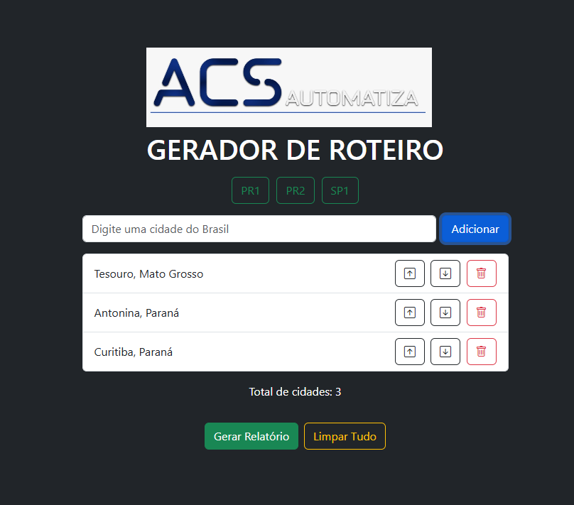
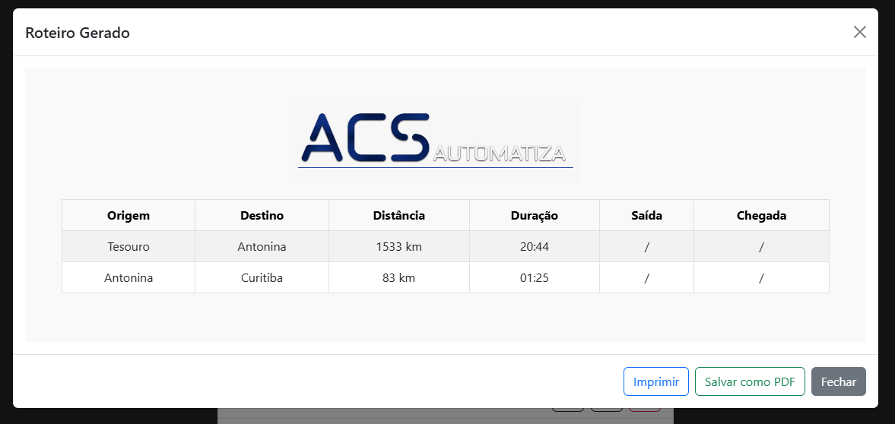

## Visão Geral 🌍

Este projeto está atualmente em produção com um cliente da ACS-AUTOMATIZA. O sistema foi desenvolvido para gerar roteiros com funcionalidades avançadas.

## Funcionalidades 🛠️

- **Tela de Login** 🔐: O acesso ao sistema é protegido por um método de autenticação utilizando `.htaccess` e `.passwd`.
  
- **Integração com n8n** 🔄: O fluxo no n8n é responsável por pegar um JSON de entrada, solicitar à API Matrix do Google Maps a distância e tempo de deslocamento entre as cidades, e formatar essa informação em HTML. O resultado é retornado ao site, onde o usuário pode gerar um PDF ou imprimir o documento.

- **Geração de Relatórios** 📊: Os usuários podem criar relatórios em PDF com as informações formatadas, além de ter a opção de imprimir diretamente a partir do modal.

## Tecnologias Usadas 💻

- **Bootstrap**: Para o design responsivo e componentes de interface.
- **HTML5**: Estruturação do conteúdo da página.
- **CSS**: Estilização e layout do projeto.
- **JavaScript**: Lógica da aplicação e manipulação do DOM e uso dentro dos nós do N8N.
- **n8n**: Integração e automação no back-end.
- **Google Maps API**: Para obtenção de dados de distância entre cidades e autocomplete da barra de pesquisa.
- **html2canvas**: Para capturar elementos DOM como imagens.
- **jsPDF**: Para gerar PDFs a partir do conteúdo HTML.

## Imagens e Privacidade 🔒

Todas as imagens foram substituídas no projeto para manter a privacidade do cliente. Nenhuma informação contida no código é realmente informação do cliente, portanto, as logos podem estar fora de proporção.

## Exemplos do Sistema 📷

Aqui estão algumas imagens do sistema em funcionamento:

## Visualização do PDF 📄

Abaixo está um exemplo de como o PDF gerado se parece:
<a href="pdf-ex.pdf">EXEMPLO-PDF</a>

## Exemplo de Fluxo no n8n 🔗

## Conclusão 🎉

Este sistema oferece uma maneira eficaz e prática de gerenciar cidades e gerar documentos, assegurando a privacidade e a segurança das informações do cliente. Estou feliz em poder contribuir com mais um projeto de automação de processos; por mais simples que pareçam, eles economizam tempo para o cliente. Se houver dúvidas ou sugestões, fique à vontade para entrar em contato.
